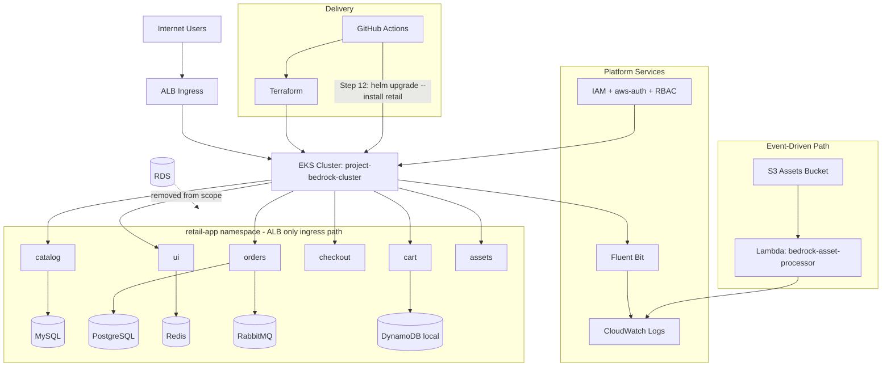

# Project Bedrock - InnovateMart EKS Infrastructure

[](https://www.terraform.io/)
[](https://aws.amazon.com/eks/)

> For a concise one-page hand-in document, see `README_SUBMISSION.md`.

## Overview

**Project Bedrock** is InnovateMart's production-grade Amazon EKS infrastructure for deploying microservices applications. This repository contains Infrastructure as Code (IaC) using Terraform to provision a secure, observable Kubernetes environment on AWS.

## Architecture

The infrastructure includes:

- **VPC**: Custom VPC with public and private subnets across 2 Availability Zones
- **EKS Cluster**: Managed Kubernetes cluster (`project-bedrock-cluster`) with managed node group
- **IAM**: Least-privilege IAM roles/policies and developer read-only user (`bedrock-dev-view`)
- **Observability**: CloudWatch logging for control plane, dataplane, and retail-store-sample-app logs
- **Serverless**: S3 bucket + Lambda event-driven asset processing (`bedrock-asset-processor`)
- **Data Services (In-Cluster)**: MySQL, PostgreSQL, RabbitMQ, Redis, and DynamoDB local
- **ALB Ingress**: AWS Load Balancer Controller with ALB ingress routing

### Architecture Diagram



## Repository Structure

```text
bedrock-eks/
├── .github/
│   └── workflows/
│       └── terraform.yml              # CI/CD pipeline
├── docs/
│   └── deployment_guideline.md        # Step-by-step deployment runbook
├── k8s/
│   ├── alb-serviceaccount.yaml
│   ├── ingress.yaml
│   ├── retail-app-values.yaml
│   └── helm-overrides/
│       ├── ui-values.yaml
│       ├── cart-values.yaml
│       ├── catalog-values.yaml
│       ├── checkout-value.yaml
│       └── orders-values.yaml
├── lambda/
│   └── asset_processor.py
├── modules/
│   ├── vpc/
│   ├── eks/
│   ├── iam/
│   ├── k8s-rbac/
│   ├── observability/
│   ├── serverless/
│   └── alb-controller/
├── scripts/
│   ├── setup-backend.sh
│   ├── setup-backend.ps1
│   ├── deploy-app.sh
│   ├── deploy-app.ps1
│   └── cleanup.sh
├── terraform/
│   ├── main.tf
│   ├── providers.tf
│   ├── variables.tf
│   ├── outputs.tf
│   ├── backend.tf
│   ├── terraform.tfvars
│   └── cicd.tfvars
├── grading.json
├── pipeline_guide.md
└── README.md
```

## Quick Start

### Prerequisites

Before you begin, ensure you have the following installed:

- **AWS CLI** v2.x
- **Terraform** v1.5+
- **kubectl** v1.28+
- **Helm** v3.13+
- **Git**

### AWS Configuration

Configure your AWS credentials:

```bash
aws configure
```

Verify identity:

```bash
aws sts get-caller-identity
```

Ensure permissions cover: VPC, EKS, IAM, S3, DynamoDB, Lambda, CloudWatch, and ELB/ALB resources.

### Step 1: Clone Repository

```bash
git clone <your-repository-url>
cd bedrock-eks
```

### Step 2: Setup Terraform Backend

Backend resources used:
- S3 bucket: `bedrock-terraform-state-alt-soe-025-1483`
- DynamoDB table: `bedrock-terraform-locks`

Linux/macOS:

```bash
cd scripts
chmod +x setup-backend.sh
./setup-backend.sh
```

Windows PowerShell:

```powershell
cd scripts
.\setup-backend.ps1
```

### Step 3: Deploy Infrastructure

```bash
cd ../terraform
terraform init
terraform validate
terraform plan
terraform apply -auto-approve
```

### Step 4: Configure kubectl

```bash
aws eks update-kubeconfig --name project-bedrock-cluster --region us-east-1
kubectl get nodes
```

### Step 5: Deploy Application

Deploy app services using Helm overrides:

```bash
helm repo add retail-app https://aws.github.io/retail-store-sample-app
helm repo update
helm upgrade --install ui oci://public.ecr.aws/aws-containers/retail-store-sample-ui-chart --version 1.4.0 -n retail-app -f k8s/helm-overrides/ui-values.yaml --create-namespace --wait --timeout 10m
helm upgrade --install catalog oci://public.ecr.aws/aws-containers/retail-store-sample-catalog-chart --version 1.4.0 -n retail-app -f k8s/helm-overrides/catalog-values.yaml --wait --timeout 10m
helm upgrade --install orders oci://public.ecr.aws/aws-containers/retail-store-sample-orders-chart --version 1.4.0 -n retail-app -f k8s/helm-overrides/orders-values.yaml --wait --timeout 10m
helm upgrade --install cart oci://public.ecr.aws/aws-containers/retail-store-sample-cart-chart --version 1.4.0 -n retail-app -f k8s/helm-overrides/cart-values.yaml --wait --timeout 10m
helm upgrade --install checkout oci://public.ecr.aws/aws-containers/retail-store-sample-checkout-chart --version 1.4.0 -n retail-app -f k8s/helm-overrides/checkout-value.yaml --wait --timeout 10m
```

Validate deployment:

```bash
helm list -n retail-app
kubectl get pods -n retail-app
kubectl get pvc -n retail-app
```

### Step 6: Apply Ingress and Access App

```bash
kubectl apply -f k8s/ingress.yaml
kubectl get ingress -n retail-app
```

Access app via:

```text
http://<ALB-DNS-NAME>
```

Health check:

```bash
curl -I http://<ALB-DNS-NAME>
```

## Configuration

### Key Resources

| Resource | Name | Purpose |
|----------|------|---------|
| EKS Cluster | `project-bedrock-cluster` | Kubernetes control plane |
| VPC | `project-bedrock-vpc` | Network isolation |
| Namespace | `retail-app` | Application isolation |
| IAM User | `bedrock-dev-view` | Developer read-only access |
| S3 Bucket | `bedrock-assets-alt-soe-025-1483` | Asset storage |
| Lambda | `bedrock-asset-processor` | Event processing |

### Terraform Variables

Customize through `terraform/variables.tf` or `terraform/terraform.tfvars`.

Example:

```hcl
aws_region          = "us-east-1"
cluster_name        = "project-bedrock-cluster"
cluster_version     = "1.34"
node_instance_types = ["t3.large"]
enable_alb_ingress  = true
enable_k8s_rbac     = true
```

## Security

### IAM Developer Access

The `bedrock-dev-view` user has:

- **AWS**: Read-only access for resource visibility
- **Kubernetes**: Read-only access via RBAC mapping in `aws-auth`

### Network Security

- EKS workers run in private subnets
- Public access is through ALB ingress path
- S3 backend bucket has versioning + encryption + public-access block

## Observability

### CloudWatch Logging

Enabled coverage includes:

- EKS control plane logs
- Dataplane and application logs
- Lambda execution logs

Useful commands:

```bash
aws logs tail /aws/eks/project-bedrock-cluster/cluster --follow
aws logs tail /aws/eks/project-bedrock-cluster/retail-store-sample-app --follow
aws logs tail /aws/lambda/bedrock-asset-processor --follow
```

## Testing

### Test Lambda Event Path

```bash
echo "Test image" > test-image.jpg
aws s3 cp test-image.jpg s3://bedrock-assets-alt-soe-025-1483/
aws logs tail /aws/lambda/bedrock-asset-processor --follow
```

Expected log contains: `Image received: test-image.jpg`

### Test Application

```bash
ALB_URL=$(kubectl get ingress retail-app-ingress -n retail-app -o jsonpath='{.status.loadBalancer.ingress[0].hostname}')
curl -I http://$ALB_URL
```

## CI/CD Pipeline

Workflow file: `.github/workflows/terraform.yml`

### Required deployment sequence (Step 12)

On push/merge to `main`, pipeline includes:

1. `terraform init`
2. `terraform plan`
3. `terraform apply`
4. `helm upgrade --install retail ...`

### CI/CD Sequence Diagram

```mermaid
flowchart LR
  PR[Pull Request to main] --> PRPLAN[Terraform Init + Validate + Plan]

  PUSH[Push/Merge to main - deployment path]
  PUSH --> INIT[1) terraform init]
  INIT --> PLAN[2) terraform plan]
  PLAN --> APPLY[3) terraform apply]
  APPLY --> OUT[Generate grading.json]
  OUT --> HELM[4) helm upgrade --install retail ...]
  HELM --> URL[Capture ALB URL in workflow summary]
```

### GitHub Secrets

Configure:

- `AWS_ACCESS_KEY_ID`
- `AWS_SECRET_ACCESS_KEY`

## Outputs

Generate outputs:

```bash
cd terraform
terraform output
terraform output -json > ../grading.json
```

Required grading outputs include:

- `cluster_endpoint`
- `cluster_name`
- `region`
- `vpc_id`
- `assets_bucket_name`
- `lambda_function_name`
- `public_subnet_ids`
- `private_subnet_ids`
- `cloudwatch_log_groups`
- `view_logs_commands`
- `developer_access_key_id` (sensitive)
- `developer_secret_access_key` (sensitive)
- `configure_kubectl`

## Cleanup

⚠️ This deletes deployed resources.

```bash
cd scripts
chmod +x cleanup.sh
./cleanup.sh
```

Or manually:

```bash
cd terraform
terraform destroy
```

## Documentation

- `docs/deployment_guideline.md` - End-to-end deployment steps and command usage
- `pipeline_guide.md` - Pipeline trigger and behavior guide

## Troubleshooting

### EKS Not Accessible

```bash
aws sts get-caller-identity
aws eks update-kubeconfig --name project-bedrock-cluster --region us-east-1
aws eks describe-cluster --name project-bedrock-cluster --region us-east-1
```

### Pods Not Starting

```bash
kubectl get pods -n retail-app
kubectl describe pod <pod-name> -n retail-app
kubectl logs <pod-name> -n retail-app
```

### ALB Not Provisioned or 503

```bash
kubectl describe ingress retail-app-ingress -n retail-app
kubectl get endpoints -n retail-app ui
kubectl logs -n kube-system deployment/aws-load-balancer-controller
```

### Lambda Not Triggering

```bash
aws s3api get-bucket-notification-configuration --bucket bedrock-assets-alt-soe-025-1483
aws lambda get-function --function-name bedrock-asset-processor
```

## Author

- **Student Name**: Jemimah Godswill
- **Student ID**: ALT/SOE/025/1483

## Disclaimer

This repository is for deployment and grading of a demo retail-store application. Resources may be destroyed after grading to avoid unnecessary cost.

---

## Support

For issues or questions:

1. Check the troubleshooting section above
2. Review `docs/deployment_guideline.md`
3. Review `pipeline_guide.md`

---

**Last Updated**: February 2026  
**Version**: 1.1.0
